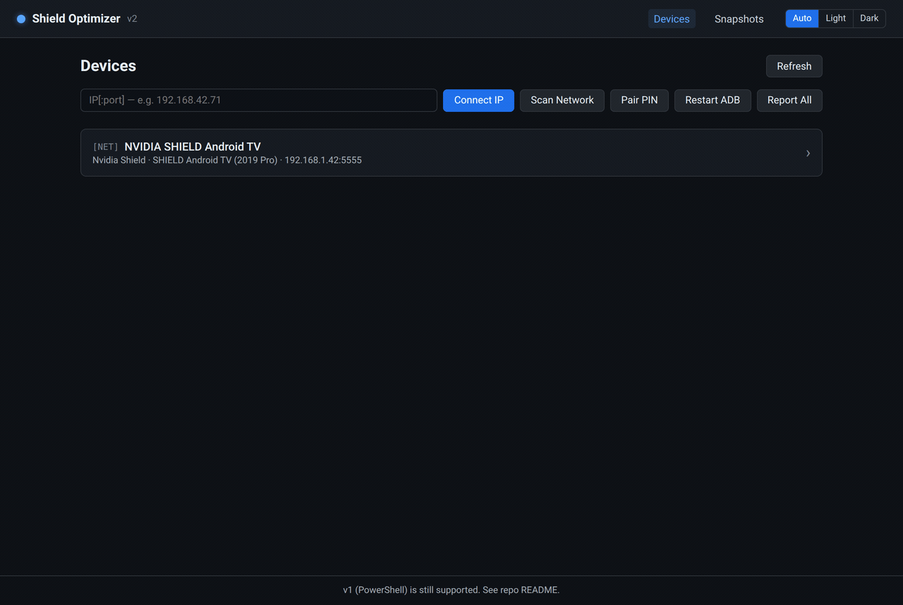
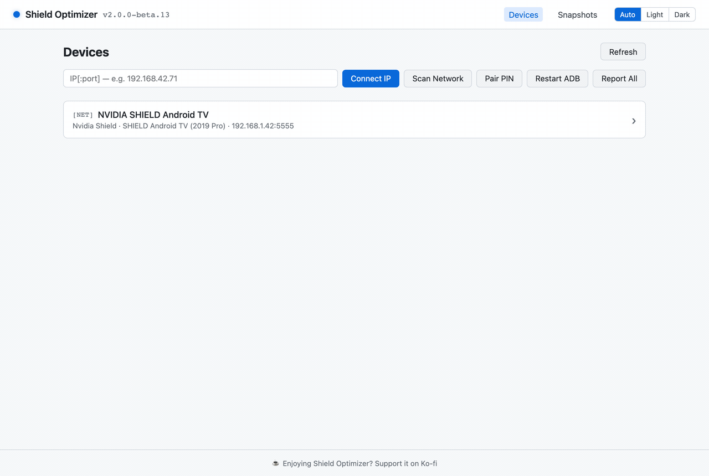
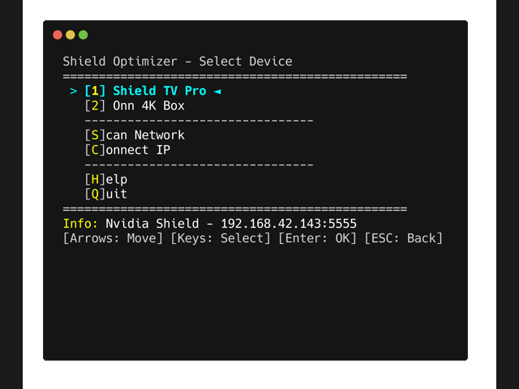

# Shield Optimizer

Debloat and tune Android TV devices — disable bloat, switch launchers, sideload APKs, tweak HDMI-CEC and frame-rate matching, and pull health reports. Works on **Nvidia Shield TV, Onn 4K Pro, Chromecast with Google TV, Google TV Streamer**, and other Android TV devices. Every change is reversible.

## Which version should I use?

There are two ways to run it. Pick one — you only need to read that version's section.

| | **v2 — Desktop app** *(recommended)* | **v1 — PowerShell script** |
|---|---|---|
| **Best for** | Most people. Click-to-install, no terminal. | Terminal users, scripting, headless/Docker. |
| **Interface** | Native windowed GUI | Text UI in your terminal |
| **Install** | Homebrew or a downloaded installer | Install PowerShell 7, run the script |
| **Platforms** | macOS, Windows, Linux | macOS, Windows, Linux (PowerShell 7+) |
| **Status** | Public beta | Stable, still maintained |

Both drive the same `adb` commands under the hood and share the same [feature catalog](docs/FEATURES.md). v1 isn't going away — it's the supported path if you'd rather stay in a terminal.

## Before you start (both versions)

Enable ADB on the TV — once, regardless of which version you use:

1. **Settings → Device Preferences → About →** click **Build** 7 times (enables Developer Options).
2. **Settings → Developer Options →** turn on **Network Debugging** (a.k.a. USB/Network debugging).

The first time the tool connects, your TV shows an **"Allow debugging?"** prompt — accept it.

---

# v2 — Desktop app (recommended)



<details>
<summary>Light theme</summary>



</details>

A native desktop app — no PowerShell, no terminal, no scripting. It bundles its own `adb` (auto-downloaded on first launch), scans your network for devices on startup, and walks you through everything with a GUI. Dark and light themes with a Light / Dark / Auto toggle.

## Install

### macOS — Homebrew (easiest)

```sh
brew tap bryanroscoe/shield-optimizer
brew install --cask shield-optimizer
```

Homebrew strips the macOS quarantine flag for you, so the app opens with a normal double-click. Upgrade later with `brew upgrade --cask shield-optimizer`.

### Any platform — download an installer

Grab the latest from the [**Releases page**](https://github.com/bryanroscoe/shield_optimizer/releases) (current builds are tagged `v2-…` and marked *pre-release* during the beta):

| OS | File |
|----|------|
| Windows | `.msi` or `_x64-setup.exe` |
| macOS | `_universal.dmg` (Apple Silicon + Intel) |
| Linux | `.AppImage`, `.deb`, or `.rpm` |

### First launch (unsigned builds)

These builds aren't code-signed yet, so your OS may warn on first launch. One-time dismissal:

- **macOS** (if you used the `.dmg` instead of Homebrew): the macOS 15+ dialog only offers *Move to Trash* / *Done*. Click **Done**, then run `xattr -dr com.apple.quarantine "/Applications/Shield Optimizer.app"`, **or** go to System Settings → Privacy & Security → **Open Anyway**. (Homebrew installs skip this entirely.)
- **Windows** (SmartScreen): **More info → Run anyway**.
- **Linux**: `chmod +x Shield*.AppImage` before running the AppImage.

## Using it

1. Launch the app. It scans your network and lists any Android TV devices found. (Or use **Connect IP**, **Scan Network**, or **Pair PIN** for Android 11+ devices.)
2. Accept the debugging prompt on your TV if asked.
3. Click your device to open it. Each tab is a feature:

| Tab | What it does |
|-----|--------------|
| **Overview** | Device profile — model, Android version, build. |
| **Health** | Temperature, RAM, storage, display mode + HDR, audio, and the top memory consumers (with risk tags). |
| **Optimize** | The debloat wizard — review each app's recommended action with its RAM usage, untick anything you want to keep, then **Run**. Reversible via Restore. |
| **Launcher** | Install Projectivy / FLauncher / ATV / Wolf, set a default, and safely disable the stock launcher. |
| **App List** | Per-app Disable / Enable / Uninstall, or install via the Play Store. |
| **Install APK** | Sideload an `.apk` from a folder. |
| **Tweaks** | HDMI-CEC, match-content frame rate, long-press timeout, animation speed, display scaling. |
| **Snapshot** | Save a device's state and re-apply it later — to the same device (rollback) or a different one (clone). |

A curated **do-not-disable list** blocks brick-tier disables from every path, and **Recovery** re-enables every disabled package if you ever need a clean slate.

Building from source / contributing? See [`v2/README.md`](v2/README.md).

---

# v1 — PowerShell script



The original cross-platform PowerShell tool. Same features, terminal UI. Requires **PowerShell 7+**.

## Install PowerShell 7 + get the script

<details>
<summary><b>Windows</b></summary>

PowerShell 7 is required; Windows Terminal is recommended.

**winget (recommended)**
```powershell
winget install --id Microsoft.PowerShell; winget install --id Microsoft.WindowsTerminal
```

**Or download installers**
- PowerShell 7: [GitHub releases](https://github.com/PowerShell/PowerShell/releases/latest) — get the `.msi`
- Windows Terminal: [Microsoft Store](https://aka.ms/terminal)

Then open Windows Terminal → PowerShell 7 and run `pwsh .\Shield-Optimizer.ps1`.
</details>

<details>
<summary><b>macOS</b></summary>

```bash
# Install Homebrew if you don't have it
/bin/bash -c "$(curl -fsSL https://raw.githubusercontent.com/Homebrew/install/HEAD/install.sh)"

# Install PowerShell
brew install powershell
```

Alternative: the `.pkg` installer from [PowerShell releases](https://github.com/PowerShell/PowerShell/releases/latest).
</details>

<details>
<summary><b>Linux (Debian/Ubuntu)</b></summary>

```bash
sudo apt-get update
sudo apt-get install -y wget apt-transport-https software-properties-common
wget -q "https://packages.microsoft.com/config/ubuntu/$(lsb_release -rs)/packages-microsoft-prod.deb"
sudo dpkg -i packages-microsoft-prod.deb
sudo apt-get update
sudo apt-get install -y powershell

pwsh ./Shield-Optimizer.ps1
```
</details>

<details>
<summary><b>Linux (Docker)</b></summary>

> *Should work, but not verified end-to-end.* Based on the workflow @shawly reported in [#9](https://github.com/bryanroscoe/shield_optimizer/issues/9).

`--network host` is required so the script can scan your LAN; `iproute2` is needed inside the container for auto-discovery.

```bash
docker run -it --rm --network host mcr.microsoft.com/powershell:latest

# Inside the container:
apt-get update && apt-get install -y iproute2
Invoke-WebRequest -Uri https://github.com/bryanroscoe/shield_optimizer/raw/refs/heads/main/Shield-Optimizer.ps1 -OutFile Shield-Optimizer.ps1
./Shield-Optimizer.ps1
```

> **Note:** `--network host` only works on native Linux. On Docker Desktop for macOS/Windows, auto-discovery won't see your LAN — install PowerShell natively or use **Connect IP**.
</details>

**Get the script:** download `Source code (zip)` from the [Releases page](https://github.com/bryanroscoe/shield_optimizer/releases/latest), or `git clone https://github.com/bryanroscoe/shield_optimizer.git`. Run it from the folder it lives in.

## Run it

```powershell
pwsh ./Shield-Optimizer.ps1
```

ADB tools download automatically on first run. A few flags:

```powershell
pwsh ./Shield-Optimizer.ps1 -ForceAdbDownload   # re-download ADB tools
pwsh ./Shield-Optimizer.ps1 -LightMode          # force light theme
pwsh ./Shield-Optimizer.ps1 -DarkMode           # force dark theme
```

(Theme auto-detects your system setting; the flags only override it.)

<details>
<summary><b>Keyboard shortcuts</b></summary>

| Key | Action |
|-----|--------|
| `↑` `↓` | Navigate menu |
| `←` `→` | Toggle options (YES/NO) |
| `1-9` | Select device by number |
| `A-Z` | Select option by highlighted letter |
| `Enter` | Confirm |
| `ESC` | Back / Cancel / Abort |
</details>

<details>
<summary><b>Troubleshooting</b></summary>

**Windows — "Running scripts is disabled on this system"**

PowerShell blocks unsigned scripts by default. Either set the execution policy once (PowerShell 7 as Administrator):
```powershell
Set-ExecutionPolicy -ExecutionPolicy RemoteSigned -Scope CurrentUser
```
or bypass for a single run: `pwsh -ExecutionPolicy Bypass -File .\Shield-Optimizer.ps1`.

**Windows — script errors or won't run**

Make sure you're on **PowerShell 7**, not Windows PowerShell 5.x (blue icon). Check with `$PSVersionTable.PSVersion` — major version should be 7+. Launch it from Windows Terminal's dropdown → "PowerShell" (not "Windows PowerShell").

**Other issues**

| Problem | Solution |
|---------|----------|
| Device not found | Enable Network Debugging, try Scan Network, check TV for auth prompt |
| Device shows UNAUTHORIZED | Accept the "Allow USB debugging?" prompt on your TV |
| Launcher won't switch | Use the Launcher Wizard, press Home after disabling stock |
| Something broke | Use Recovery to re-enable all disabled packages |
| Wrong device type | Check Profile view; detection uses brand/model/packages |
| Scan finds nothing (macOS/Linux) | Ensure Network Debugging is on; try Connect IP |
| Colors hard to read | Try `-LightMode` or `-DarkMode` |
</details>

### Experimental (v1, untested on real devices)

| Feature | Notes |
|---------|-------|
| **USB device support** | `[USB]` tag in the device list. Shield TV doesn't support USB debugging (host ports only); works with phones/tablets. |
| **PIN pairing** | For Android 11+ / Google TV devices that require pairing codes. Not needed for Shield (use Connect IP). |

---

## Tested devices

| Device | Status |
|--------|--------|
| Nvidia Shield TV (2015/2017/2019) | Fully tested |
| Onn 4K Pro (Walmart) | Fully tested |
| Chromecast with Google TV | Should work (Google TV profile) |
| Google TV Streamer (2024) | Should work (Google TV profile) |

## Safety

- **Disable over uninstall** — changes are reversible (Restore / Optimize-again).
- **Recovery** — emergency re-enable of every disabled package.
- A **do-not-disable list** guards system-critical packages from every code path.

**Use at your own risk.** Modifying system apps carries some risk, but this tool prioritizes safe, reversible changes.

## Feature catalog

[docs/FEATURES.md](docs/FEATURES.md) is the canonical, language-agnostic spec of every behavior — bloat lists, ADB commands, edge cases. Both versions are built against it; PRs that add or change a feature update it in the same commit.

## Credits

- Debloat research from community guides including [florisse.nl/shield-debloat](https://florisse.nl/shield-debloat/)
- Built with AI assistance (Gemini Pro and Claude) by an actual software engineer, tested on real devices
